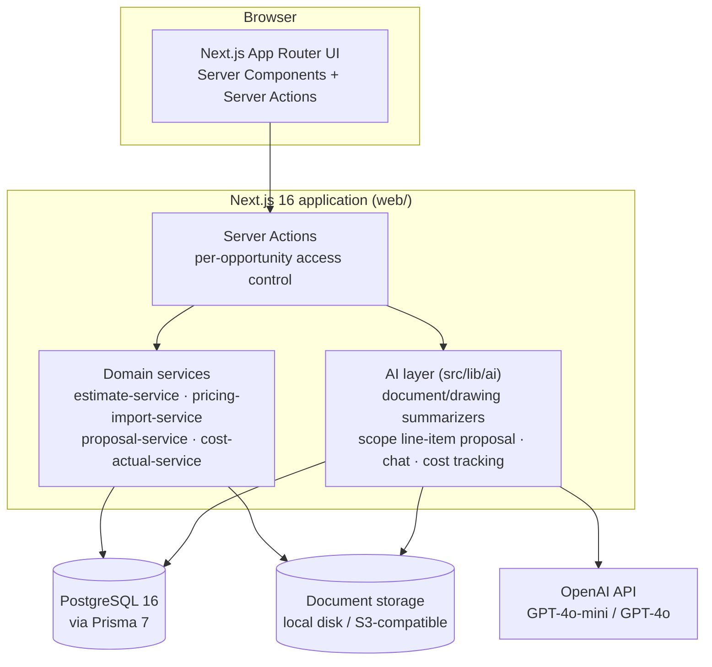

<div align="center">

# ForgeOS

**A native CRM → Estimate → Proposal → Project workflow for event & exhibit fabrication contractors — replacing a single, decades-deep Excel workbook with a validated, full-stack web application.**

[](https://github.com/Vintaragroup/ForgeOS/actions/workflows/ci.yml)


</div>

---

## What this is

Exhibit and convention fabrication shops have historically run their entire estimate-to-invoice
pipeline out of one enormous Excel workbook — hundreds of interlinked formulas across dozens of
sheets, with no CRM, no audit trail, and no way for more than one person to safely work on a job
at a time.

**ForgeOS is a from-scratch, native re-implementation of that workflow**, built with a strict
migration discipline: *the workbook stays the system of record until each phase is independently
reconciled against it, using real historical job data — never synthetic numbers.* Phase 0–1
forensically audited and imported a real, populated workbook before a single line of new business
logic was written (see [`docs/`](docs/)); every phase since has been validated the same way.

The result is a single application that takes a job from an inbound RFP all the way through a
signed, priced proposal, production, and actual-cost reconciliation — with AI assistance layered
on top of the real documents a job actually generates, not a general-purpose chatbot bolted onto
the side.

## Lifecycle

```mermaid
flowchart LR
    Lead["Lead"] --> Opp["Opportunity"]
    Opp --> Estimate["Estimate<br/>sections · line items · margin targets"]
    Estimate --> Proposal["Proposal<br/>branded PDF, e-signature attestation"]
    Proposal --> Options["Revisions / Options<br/>priced alternates"]
    Options --> Approval["Approval<br/>locked, audited EstimateVersion"]
    Approval --> ChangeOrder["Change Order<br/>diffed against the approved version"]
    Approval --> Project["Project / Work Order<br/>deposit → production → install"]
    ChangeOrder --> Project
    Project --> Actuals["Actual Cost Capture<br/>estimated vs. incurred variance"]

    style Estimate fill:#0b3d91,color:#fff
    style Proposal fill:#0b3d91,color:#fff
    style Approval fill:#0b3d91,color:#fff
```



## Feature highlights

| Area | What it does |
|---|---|
| **CRM & Opportunities** | Companies, contacts, opportunity pipeline stages, per-opportunity collaborator access control, dashboard deadline tracking |
| **Native estimate engine** | Sections, line items, margin targets, locking/versioning, catalog-backed rate suggestions, real Decimal-precision math validated against real historical jobs |
| **Proposals & approval** | Branded PDF generation, an audited approval gate on a locked estimate version, typed-name signature attestation |
| **Change orders** | Diffed against the approved baseline version — not a from-scratch re-estimate |
| **Projects & production** | Work orders, schedule auto-fill from extracted RFP key dates, actual-cost capture and estimated-vs-actual variance reporting |
| **AI-assisted document intelligence** | Structured GPT extraction of scope, risk flags, and key dates from uploaded RFPs/contracts, with every fact resolved back to a clickable citation in the source document |
| **AI-assisted estimating** | Proposes draft line items from Scope-of-Work text (fixed, consistent category taxonomy across runs) and catalog-matched rates from imported pricing schedules — every draft requires human confirmation before it counts |
| **CAD / drawing analysis** | Vision-based extraction of dimensions, materials, and risk callouts from fabrication drawings, with a low-yield signal flagging likely bad extractions |
| **One-click estimate synthesis** | Builds a full estimate from every analyzed document on an opportunity in a single pass, instead of importing one document at a time |
| **In-app chat** | Ask questions about an opportunity's documents, answered with inline citations |
| **Cost governance** | Per-user, per-feature OpenAI token/cost tracking with case-based model tiering (cheap model for extraction, stronger model for vision) |
| **Vendor bid packages & AI matching** | Group line items for outsourced vendor pricing, AI-match a vendor's quote against the whole estimate (deterministic position-code matching before AI, holistic matching after), bulk-apply duplicate matches with a durable per-apply audit trail, and a category audit that catches anything that would silently fall into "Other" on the client-facing PDF |

## Architecture



## Tech stack

| Layer | Choice |
|---|---|
| Framework | Next.js 16 (App Router, Server Actions, Turbopack) |
| Language | TypeScript, strict mode throughout |
| Database | PostgreSQL 16 via Prisma 7 (driver adapter, no legacy `datasource.url`) |
| AI | OpenAI GPT-4o-mini / GPT-4o, Structured Outputs (`json_schema`, `strict: true`) |
| PDF generation | `@react-pdf/renderer` — no headless-browser dependency |
| Testing | Vitest, against a real (not mocked) Postgres test database |
| Deployment | Production: Vercel (app) + Render (Postgres) + Vercel Blob (files) — auto-deploys on push to `main`. Docker multi-stage build (`web/Dockerfile`, `web/docker-compose.yml`) is a self-host alternative, not the production path. |

## Getting started

```bash
git clone https://github.com/Vintaragroup/ForgeOS.git
cd ForgeOS/web

brew install postgresql@16   # or your platform's equivalent
brew services start postgresql@16
createdb forgeos_dev
createdb forgeos_test        # separate database for the test suite

npm install
cp .env.example .env         # fill in DATABASE_URL / SESSION_SECRET, see below
npx prisma generate
npx prisma migrate deploy
npm run seed                 # loads real labor rates, rental prices, and a starter materials catalog

npm run dev                  # http://localhost:3000
```

`OPENAI_API_KEY` is optional — every AI feature degrades to a clear "not configured" state instead
of crashing when it's unset, so the rest of the app works without it. Full environment variable
reference lives in [`web/.env.example`](web/.env.example).

```bash
npm test        # vitest, against forgeos_test
npm run lint    # eslint
npm run build   # production build + full typecheck
```

## Project structure

```
ForgeOS/
├── web/                  # The application — Next.js 16, Prisma 7, all product code
│   ├── src/app/          # Route handlers & pages (App Router, grouped by (app)/(auth))
│   ├── src/lib/          # Domain services (estimate, pricing import, proposals, cost actuals…)
│   ├── src/lib/ai/       # AI-assisted features (document/drawing analysis, chat, cost tracking)
│   └── prisma/           # Schema, migrations, seed data
├── docs/                 # Phased migration plan, workbook audit findings, business rules,
│                          # data model, dependency map, risk register — the paper trail behind
│                          # every modeling decision in web/prisma/schema.prisma
├── tools/                # Standalone audit & import tooling used during the Excel migration
├── tests/                # Test suites for the audit/import tooling (separate from web/'s own tests)
└── data/                 # Local-only reference/historical job data (gitignored where sensitive)
```

## Documentation

The `docs/` folder is the paper trail behind every business rule and schema decision in this
project — read these before assuming a modeling choice is arbitrary:

| Doc | Contents |
|---|---|
| [`docs/migration-plan.md`](docs/migration-plan.md) | Phase-by-phase plan and exit criteria, phases 0–6 |
| [`docs/workflow-map.md`](docs/workflow-map.md) | The full lead → closeout lifecycle, marked evidenced vs. inferred against the source workbook |
| [`docs/business-rules.md`](docs/business-rules.md) | Business rules extracted directly from workbook formulas |
| [`docs/data-model-v0.md`](docs/data-model-v0.md) | The domain model this schema was designed against |
| [`docs/workbook-dependency-map.md`](docs/workbook-dependency-map.md) | Sheet-by-sheet formula dependency graph of the source workbook |
| [`docs/risk-register.md`](docs/risk-register.md) | Known gaps and open questions carried forward between phases |
| [`web/README.md`](web/README.md) | Application-level setup, stack-specific gotchas, and per-phase scope/exit criteria |

## License

Proprietary — internal Vintara Group project. Not licensed for external use or redistribution.
