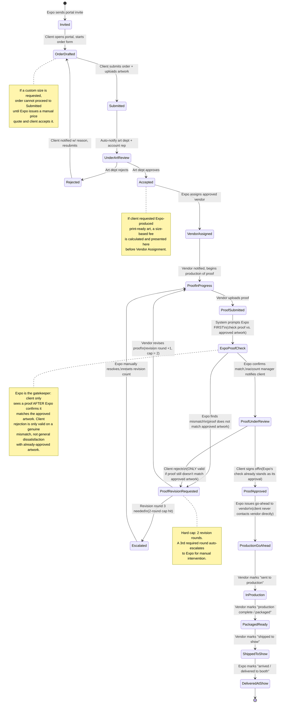
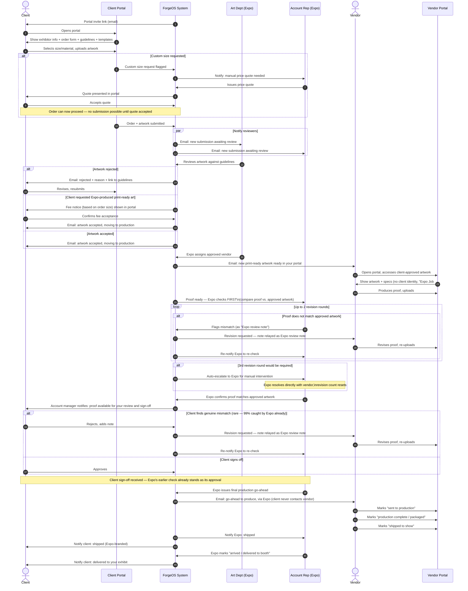

# ForgeOS: Client → Expo → Vendor Artwork Pipeline

**A feature specification for the artwork intake, approval, production, and fulfillment workflow**

---

## 1. Overview

This document specifies a new ForgeOS feature: a portal-driven pipeline that takes exhibitor
artwork from initial client submission through art department review, vendor production, proof
approval, and final delivery to the show floor.

Three actors participate:

| Actor | Role |
|---|---|
| **Client** | The exhibitor. Submits order details and artwork, reviews proofs, gives final sign-off. |
| **Expo (CCI)** | The account owner. Reviews artwork against guidelines, assigns vendors, brokers all communication, gives final production go-ahead. |
| **Vendor** | The production partner. Produces the proof and the physical print, updates production/shipping status. |

**Core design constraint: vendor anonymity.** The client must never learn which vendor is
producing their artwork. Every touchpoint the client sees — portal branding, email senders,
notifications, uploaded proof file metadata — must appear as Expo-originated. The vendor is
functionally an invisible extension of Expo's production department. This constraint touches
almost every screen and notification in this spec and is called out again in Section 5.

---

## 2. Lifecycle State Diagram

This tracks the artwork order itself as it moves through states. Use this as the source of truth
for what status badge appears in each portal.



---

## 3. Cross-Party Sequence Diagram

This tracks *who is notified, when, and by what trigger* — the choreography between the three
portals. Note that every vendor-facing message is written and sent under Expo's identity, and
every client-facing message referencing production is also written under Expo's identity.



---

## 4. Notification Matrix

A companion reference to the sequence diagram — use this as the build spec for email/notification
templates.

| # | Trigger Event | Notified | Channel | What They See |
|---|---|---|---|---|
| 1 | Expo creates client record | Client | Email | Portal invite link |
| 2 | Order + artwork submitted | Art Dept, Account Rep | Email + in-app | Link to review queue item |
| 3 | Art dept rejects | Client | Email + in-app | Rejection reason, link to graphics guidelines, resubmit CTA |
| 4 | Client opts into Expo-produced print-ready art | Client | In-app (real-time) | Fee amount, tied to order size tier |
| 5 | Art dept accepts | Client | Email + in-app | "Artwork accepted" confirmation |
| 6 | Expo assigns vendor | Vendor | Email | "New job ready" — Expo-branded, job number only, no client name/company |
| 7a | Vendor uploads proof | Account Rep (Expo) only | Email + in-app | Proof file, prompt to compare against approved artwork — **client not yet notified** |
| 7b | Expo confirms proof matches approved artwork | Client | Email + in-app | Proof file, review + sign-off CTA — sent by account manager |
| 8 | Expo (pre-client) or Client (post-client, rare) flags a mismatch | Vendor | In-app (Expo-attributed) | Note text as "Expo review note," revised-proof upload prompt |
| 8a | 3rd revision round would be required | Account Rep (Expo) | Email + in-app | Escalation alert — cap of 2 rounds hit, manual intervention needed |
| 9 | Client signs off on proof | Vendor | Email | Go-ahead notice (sent by Expo) |
| 10 | Vendor: sent to production | Account Rep | In-app status change | Status badge update only |
| 11 | Vendor: packaged/complete | Account Rep | In-app status change | Status badge update only |
| 12 | Vendor: shipped to show | Account Rep, Client | Email + in-app | "Shipped" status (Expo-branded to client) |
| 13 | Expo: arrived/delivered | Client | Email + in-app | "Delivered to your exhibit" confirmation |

**Identity-masking rule enforced at rows 6–9, 12:** no vendor name, vendor contact info, or vendor
company branding appears in any client-facing artifact. No client name/company appears in
vendor-facing job assignments beyond what's operationally necessary (booth number, size, material
— not company name if avoidable, or a job code substituted).

---

## 5. Business Rules

| Rule | Detail |
|---|---|
| **Rejection loop (art review)** | Rejected artwork returns to `OrderDrafted`, not a dead end — client can resubmit indefinitely until accepted or the order is cancelled by Expo. |
| **Custom size request** | Requires a manual Expo price quote before the order can proceed. The order **cannot** be submitted until Expo issues the quote and the client explicitly accepts it — this is a hard gate, not provisional. |
| **Expo-produced art fee** | Triggered only when client explicitly opts in (not automatic). Fee is calculated from order size tier and displayed for confirmation before the order proceeds. Fee tiers should live in a config table, not hardcoded — this mirrors the ForgeOS catalog-backed rate pattern used in the estimate engine. |
| **Proof review is Expo-gated, not simultaneous** | Vendor's proof goes to Expo first, never to the client directly. Expo compares the proof against the client's approved artwork. Only after Expo confirms a match does the account manager release the proof to the client for sign-off. |
| **Client rejection scope is narrow** | The client cannot reject a proof for general dissatisfaction with artwork they already approved. A client rejection is only valid if the vendor-produced proof genuinely does not match the artwork the client approved — expected to be rare (~1% of cases), since Expo's check catches mismatches first. |
| **Proof notes are fully unified** | All revision notes — whether originated by Expo or (rarely) by the client — are relayed to the vendor as generic "Expo review notes." No attribution to a specific party, consistent with the vendor-anonymity principle running in the other direction. |
| **Revision round cap** | Maximum 2 revision rounds between vendor and Expo/client. A 3rd required round auto-escalates to Expo for manual, off-system intervention; the revision counter resets once Expo resolves it directly with the vendor. |
| **Vendor anonymity** | Absolute — enforced at the notification-template layer, portal-branding layer, and file-metadata layer (strip vendor identifying info from uploaded PDFs before client-facing display, if present in file properties). |
| **Production go-ahead ownership** | Only Expo can issue the final go-ahead to the vendor, even after client approval — this is a deliberate control point, not a bottleneck to remove. |
| **Delivery confirmation ownership** | Only Expo marks "delivered," since Expo has show-site visibility the vendor lacks. |

---

## 6. Wireframes

Low-fidelity, functionality-focused. Each block describes layout + interactive elements, not
visual styling.

### 6.1 Client Portal — Landing / Exhibitor Info

```
┌──────────────────────────────────────────────────────┐
│  [Expo Logo]           Exhibitor Portal — Acme Co.    │
├──────────────────────────────────────────────────────┤
│  Booth #: 214        Show: NAB 2027                   │
│  Contact: Jane Smith        Status: ● Order Not Started│
├──────────────────────────────────────────────────────┤
│  [ Start / Continue Order ]  [ View Graphics Guide ]  │
└──────────────────────────────────────────────────────┘
```

### 6.2 Client Portal — Order Form

```
┌──────────────────────────────────────────────────────┐
│  Step 1 of 2: Order Details                           │
├──────────────────────────────────────────────────────┤
│  Size:      ( ) 8x10 std   ( ) 10x20 std               │
│             ( ) Request custom size → [ W ] x [ H ]    │
│  Material:  [ Dropdown: Fabric / Vinyl / Rigid... ]    │
│  Qty:       [   1   ]                                  │
│  □ I want Expo to produce my print-ready artwork       │
│      (fee applies based on size — shown after submit)  │
├──────────────────────────────────────────────────────┤
│  If custom size selected:                              │
│  ⏳ Quote Pending — Expo is preparing a custom price     │
│     quote. You cannot continue until it's issued and    │
│     accepted below.                                     │
│  [ Custom Quote: $______ ]      [ Accept Quote ]        │
├──────────────────────────────────────────────────────┤
│                              [ Continue → ]  (disabled  │
│                     until custom quote accepted, if any)│
└──────────────────────────────────────────────────────┘
```

### 6.3 Client Portal — Guidelines, Template & Upload

```
┌──────────────────────────────────────────────────────┐
│  Step 2 of 2: Artwork                                 │
├──────────────────────────────────────────────────────┤
│  📄 Artwork Guidelines (PDF)         [ Download ]      │
│  🎨 Illustrator / PDF Template       [ Download ]      │
├──────────────────────────────────────────────────────┤
│  Upload Your Artwork                                  │
│  ┌──────────────────────────────────────────────┐    │
│  │        Drag file here or [ Browse... ]        │    │
│  └──────────────────────────────────────────────┘    │
│  Accepted: PDF, AI  |  Max 500MB                      │
├──────────────────────────────────────────────────────┤
│  [ ← Back ]                        [ Submit Order ]   │
└──────────────────────────────────────────────────────┘
```

### 6.4 Client Portal — Status Tracker (post-submission)

```
┌──────────────────────────────────────────────────────┐
│  Order Status — Booth #214                            │
├──────────────────────────────────────────────────────┤
│  ✔ Submitted                                          │
│  ✔ Artwork Accepted                                   │
│  ● Proof Under Review  ← you are here                 │
│  ○ In Production                                      │
│  ○ Shipped to Show                                    │
│  ○ Delivered to Booth                                 │
├──────────────────────────────────────────────────────┤
│  [ View Proof ]   [ Approve ]   [ Add a Note ]        │
└──────────────────────────────────────────────────────┘
```

### 6.5 Expo Internal — Review Queue

```
┌──────────────────────────────────────────────────────┐
│  Art Review Queue                     [ Filter ▾ ]     │
├──────────────────────────────────────────────────────┤
│  Booth 214 · Acme Co.        Submitted 2h ago  [Review]│
│  Booth 108 · Beta Inc.        Submitted 1d ago  [Review]│
│  Booth 302 · Gamma LLC       Rejected — resubmitted    │
└──────────────────────────────────────────────────────┘
```

### 6.5a Expo Internal — Document Review + Approve/Reject

```
┌──────────────────────────────────────────────────────┐
│  Reviewing: Booth 214 · Acme Co.                      │
├──────────────────────────────────────────────────────┤
│  [ Artwork Preview Pane ]      Size: 10x20 std          │
│                                Material: Fabric         │
│                                Expo-produced art: No    │
├──────────────────────────────────────────────────────┤
│  Guideline Checklist:                                 │
│  ☑ Bleed/margins correct   ☑ Color mode correct        │
│  ☐ Resolution sufficient                              │
├──────────────────────────────────────────────────────┤
│  [ Reject — reason: ______________ ]   [ Approve ]     │
└──────────────────────────────────────────────────────┘
```

### 6.6 Expo Internal — Vendor Assignment

```
┌──────────────────────────────────────────────────────┐
│  Assign Vendor — Booth 214                            │
├──────────────────────────────────────────────────────┤
│  Approved Vendors:                                     │
│  ( ) PrintCo Solutions   ( ) Vendor B   ( ) Vendor C   │
├──────────────────────────────────────────────────────┤
│                              [ Assign & Notify ]       │
└──────────────────────────────────────────────────────┘
```

### 6.7 Expo Internal — Proof Oversight Dashboard

```
┌──────────────────────────────────────────────────────┐
│  Proof Review — Booth 214           Revision round: 1/2│
├──────────────────────────────────────────────────────┤
│  [ Proof Preview Pane ]     [ Approved Artwork Pane ]  │
│                              (side-by-side compare)     │
│  Expo Gate Status:  ⏳ Not yet checked against approved  │
│                        artwork — client cannot see this │
│                        proof until you clear it here    │
├──────────────────────────────────────────────────────┤
│  Notes (relayed to vendor as "Expo review note"):      │
│   - "Logo bleed doesn't match approved file — recheck" │
├──────────────────────────────────────────────────────┤
│  [ ✔ Matches Approved Artwork — Release to Client ]    │
│  [ ✘ Mismatch — Request Revision ]                     │
├──────────────────────────────────────────────────────┤
│  ⚠ Revision round 2 of 2 in progress. A 3rd required   │
│    round will auto-escalate for manual intervention.   │
├──────────────────────────────────────────────────────┤
│  ⏱ SLA: check due within 24h (tightens to 4h in final  │
│    show week). Overdue → flagged on Expo dashboard.    │
└──────────────────────────────────────────────────────┘
```

### 6.7b Expo Internal — Escalation Resolution (3rd revision round)

```
┌──────────────────────────────────────────────────────┐
│  Escalated — Booth 214           Round cap (2) reached │
├──────────────────────────────────────────────────────┤
│  This job requires manual resolution before it can     │
│  re-enter the proof cycle.                             │
├──────────────────────────────────────────────────────┤
│  Resolution Note (required):                           │
│  ┌──────────────────────────────────────────────┐    │
│  │  What was agreed / who was contacted...       │    │
│  └──────────────────────────────────────────────┘    │
│                    [ Log & Reset Revision Count ]      │
└──────────────────────────────────────────────────────┘
```

### 6.7a Client Portal — Proof Sign-off (only visible after Expo clears the gate)

```
┌──────────────────────────────────────────────────────┐
│  Proof Ready for Your Review — Booth 214              │
├──────────────────────────────────────────────────────┤
│  [ Proof Preview Pane ]                                │
│  This proof has been reviewed by your account manager  │
│  and matches your approved artwork.                    │
├──────────────────────────────────────────────────────┤
│  [ Approve — Send to Production ]                      │
│  [ Report a Mismatch ] (only for genuine artwork       │
│     discrepancies, not general revision requests)      │
└──────────────────────────────────────────────────────┘
```

### 6.8 Vendor Portal — Assignment Notice / Artwork Access

```
┌──────────────────────────────────────────────────────┐
│  [Expo Logo]        Vendor Production Portal          │
├──────────────────────────────────────────────────────┤
│  Job #: EXPO-00214        Show: NAB 2027               │
│  Size: 10x20 std     Material: Fabric                  │
│  (no client company/contact name shown)               │
├──────────────────────────────────────────────────────┤
│  [ Download Print-Ready Artwork ]                      │
└──────────────────────────────────────────────────────┘
```

### 6.9 Vendor Portal — Proof Upload & Production Status

```
┌──────────────────────────────────────────────────────┐
│  Job #: EXPO-00214                                     │
├──────────────────────────────────────────────────────┤
│  Upload Proof:                                        │
│  ┌──────────────────────────────────────────────┐    │
│  │        Drag file here or [ Browse... ]        │    │
│  └──────────────────────────────────────────────┘    │
│                              [ Submit Proof ]          │
├──────────────────────────────────────────────────────┤
│  Production Status:                                    │
│  ○ Awaiting Go-Ahead                                   │
│  ○ Sent to Production   [ Mark Complete ]              │
│  ○ Packaged / Ready     [ Mark Shipped ]               │
│  ○ Shipped to Show                                     │
│    (grayed out until previous status is set;           │
│     Go-Ahead button only appears after Expo issues it) │
└──────────────────────────────────────────────────────┘
```

---

## 7. Page/Functionality Summary Table

| Page | Portal | Key Functions |
|---|---|---|
| Landing / Exhibitor Info | Client | View booth/show info, launch order flow |
| Order Form | Client | Select size (standard or custom request), material, opt into Expo art production |
| Guidelines & Upload | Client | Download guide/template, upload artwork, submit |
| Status Tracker | Client | View lifecycle progress, view/approve proof, add notes |
| Review Queue | Expo | List all pending/active submissions |
| Document Review | Expo | Preview artwork, checklist against guidelines, approve/reject with reason |
| Vendor Assignment | Expo | Select from approved vendor list, trigger notification |
| Proof Oversight | Expo | Review proof, track dual-approval state, relay notes, issue go-ahead |
| Vendor Assignment Notice | Vendor | View job spec (client-anonymized), download approved artwork |
| Proof Upload & Status | Vendor | Upload proof, update production/shipping status sequentially |

---

## 8. Resolved Decisions Log

| Question | Decision |
|---|---|
| Does a custom size request need a manual Expo quote before the order proceeds? | Yes — hard gate. No submission possible until Expo issues a quote and client accepts it. |
| Should revision notes distinguish client vs. Expo authorship? | No — fully unified as generic "Expo review notes," consistent with vendor-anonymity principle. |
| What happens if a client rejects after Expo already approved? | Client cannot reject over general dissatisfaction — Expo checks proof against approved artwork first, and only releases it to the client once confirmed. Client rejection is only valid for a genuine mismatch, which is expected to be rare since Expo catches nearly all discrepancies first. |
| Is there a cap on proof revision rounds? | Yes — 2 rounds. A 3rd required round auto-escalates to Expo for manual, off-system resolution; the counter resets after that intervention. |
| What is the SLA for Expo's initial proof check? | 1 business day (24 hrs), dynamic — tightens automatically as the show date approaches (e.g., 24 hrs normally, 4 hrs in the final week). Not a hard system block; exceeding it raises a visible flag/escalation signal on the Expo dashboard rather than silently sitting in queue. |
| Does the custom-size quote flow need a negotiation loop? | No — accept/cancel only for v1. If a client wants to negotiate, that happens off-system (account rep conversation), and Expo re-issues a revised quote in-app afterward. The system is the record of the final number, not the negotiation venue — consistent with how escalated revisions are already handled off-system. |
| Does an escalated (3rd-round) manual resolution need its own audit log? | Yes — non-negotiable. Expo must enter a brief resolution note in-system (what was agreed, who was contacted) before the job can re-enter `ProofInProgress`. Every other approval/rejection/go-ahead in this pipeline is auditable; the one case where things went sideways is exactly the case that can't be allowed to go unlogged. |
| Should the SLA-exceeded flag notify anyone, or stay passive on the dashboard? | Both, staged. Passive dashboard flag the moment the SLA deadline passes. Active notification (email/Slack-style) to a senior manager only if still unresolved **50% past** the SLA window (e.g., 12h late on a 24h SLA, 2h late on a 4h show-week SLA) — gives staff a chance to self-correct before it escalates, while avoiding alert fatigue from notifying the instant the deadline passes. |
| Structured field or free-text for the off-system negotiation log? | Structured but minimal: *who was contacted* (name/role), *outcome* (dropdown: revised quote issued / client cancelled / held at original price), plus one free-text note for context. Pure free-text would leave this the one unreportable gap in an otherwise fully auditable pipeline. |
| Who should see the escalation resolution note — vendor, client, both, or Expo-internal only? | Expo-internal only. Consistent with vendor anonymity (client shouldn't see Expo-vendor management detail) and the unified "Expo review notes" pattern (vendor shouldn't know this was a 3rd-round escalation vs. a normal revision) — surfacing it to either party breaks the seamless-Expo abstraction the pipeline depends on. |
| Fixed role or configurable per show/account for the escalation notification? | Configurable per show, with a fixed-role fallback. Defaults to a fixed role (Account Rep on the job) so no setup burden on every show, but can be overridden per show when a larger show needs broader routing (e.g., account manager + production lead) — sensible default, escape hatch for the exception. **Implementation:** a config field on the show record itself (alongside show dates, approved vendor list, etc.), editable by the account manager or admin during show setup — no standalone UI needed for a rarely-touched setting. |
| Does "held at original price" auto-close the custom-size request, or need explicit client re-acceptance? | Requires explicit client re-acceptance — no auto-close. The client is still mid-negotiation on a price they haven't agreed to in this round; silently reactivating the original quote risks the client feeling their pushback was ignored. Matches the "nothing proceeds without explicit client yes" pattern used everywhere else in this spec (guidelines, fee, proof sign-off). **If the client declines:** routes back to Expo as a new decision point (re-quote, escalate, or Expo/client explicitly cancels) rather than auto-cancelling — a decline likely means "still negotiating," not "done," so a human should make the actual cancel/continue call. |
| Does the resolution note need restricted visibility distinct from the rest of the audit trail? | Yes. Scoped to the account manager on the job, their manager, and system admins — not all Expo staff. These notes can contain sensitive internal color (vendor performance issues, pricing concessions, awkward client conversations). Regular staff still see that an escalation *happened* (status badge) but not the note contents. **No new permission role needed** — confirmed against `web/prisma/schema.prisma`: reuse the existing `SystemRole` enum (`ADMIN`/`SUPER_ADMIN`) plus `Opportunity.ownerId` + `OpportunityCollaborator`, which already implement exactly this "owner/collaborator or admin" access pattern for opportunity-scoped data. Visibility rule: `systemRole IN (ADMIN, SUPER_ADMIN)` OR `user.id == opportunity.ownerId` OR `user.id IN opportunity.collaborators`. Should reuse whatever shared access-check helper already gates opportunity data, rather than writing this check fresh. |

## 9. Technical Implementation Notes

Given the existing ForgeOS stack — **Render (PostgreSQL)**, **Vercel Blob** (file storage), **Vercel**
(frontend/serverless hosting) — this pipeline should be built as native features on top of that
stack rather than adopting a separate collaboration platform (e.g., Box, Nextcloud). A bolted-on
platform would duplicate storage/infra already in place and would fight the vendor-anonymity and
dual-gate approval rules, which no off-the-shelf tool is designed around.

| Need | Recommended approach | Why |
|---|---|---|
| **File intake** (client upload, vendor artwork access) | Vercel Blob, signed upload URLs | Already in the stack — functionally equivalent to Box's File Request, no new infra |
| **Proof rendering & markup** | `pdf.js` (Mozilla, OSS) for in-browser rendering + `Fabric.js` or `Konva.js` for a canvas markup overlay | Annotations stored as structured data in Postgres, not a black-box file — keeps notes queryable and tied into the existing dual-approval/notes model |
| **Automated proof-vs-approved-artwork pre-check** | `pixelmatch` or `resemble.js` (OSS image diffing) | Runs automatically the moment a vendor uploads a proof, producing a similarity score *before* Expo opens it — e.g. "99.2% match, low risk" vs. "flagged — review closely." Directly supports the 24h/4h SLA from Section 8 by triaging Expo's queue instead of treating every proof as equally urgent to review. |
| **Workflow/state orchestration** | Native Prisma-backed state machine (as already spec'd in Section 2) | Sufficient for this scope. Consider `Temporal` (OSS) only if multi-step async reliability becomes a real operational pain point — not worth the added complexity up front |

**Suggested addition to the proof-check flow (Section 3 / 6.7):** when a vendor uploads a proof,
run the image-diff check server-side immediately, store the similarity score against the proof
record, and surface it in the Expo review UI (Section 6.7) as a risk badge — this doesn't replace
Expo's manual check but focuses their attention where it's actually needed.

## 10. Open Questions for Next Pass

- Is there an existing shared access-check helper (e.g. `canAccessOpportunity`) that the resolution-note visibility rule should call into, or does one need to be introduced as part of this feature?
- Does a declined "held at original price" outcome count toward the 2-round revision cap the same way a proof revision does, or is it tracked as a separate negotiation-round counter?
- Should the per-show escalation-notification config default to the opportunity's `ownerId`, or should it always be settable independently in case the show's point of contact differs from the opportunity owner?
