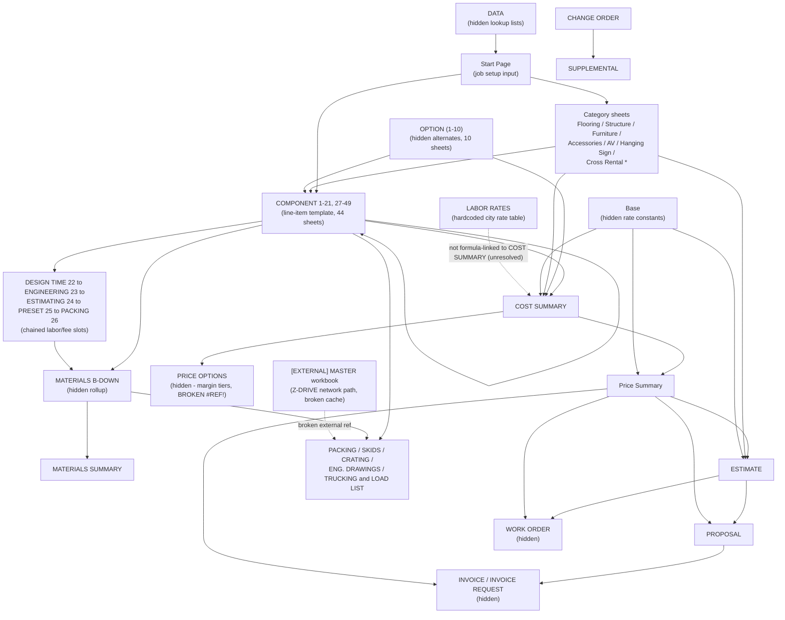

# ForgeOS Workbook — Dependency Map

Source: `artifacts/formula_catalog.json` (22,138 formulas across 95 sheets),
cross-referenced against `artifacts/named_ranges.json` and
`artifacts/external_links.json`. Edge weight = number of formulas on the
source sheet that reference the target sheet. Confidence: **High** for edge
existence (directly parsed from formula text); **Medium** for the semantic
grouping/labels applied to layers below.

## 1. Repeated template families

| Family | Members | Confidence |
|---|---|---|
| `COMPONENT N` | 44 sheets: COMPONENT 1–21, 27–49 | High (contiguous except 22–26, see below) |
| `OPTION (N)` | 10 sheets: OPTION (1)–(10), all hidden | High |
| Category "line" sheets | Flooring, Structure, Furniture, Accessories, AV, Hanging Sign, Cross Rental Furniture/AV/TBD 1/TBD 2, Hanging Sign Coverup — 10 sheets, structurally similar (each has a `COMPONENT_FAMILY` inbound edge and a `Start Page` inbound edge) | Medium |

**Anomaly (Medium confidence):** sheet-name numbering 1–49 that should
correspond to `COMPONENT N` is broken at slots 22–26, which are instead
named `DESIGN TIME 22`, `ENGINEERING 23`, `ESTIMATING 24`, `PRESET 25`,
`PACKING 26`. These are not generic material components — they carry
formulas that pull only from the COMPONENT family (not vice versa, mostly)
and appear to represent labor/fee line-item types (design time, engineering
time, estimating fee, a "preset" bucket, and packing) inserted into the same
template chain used for physical components. Unresolved question: was this
intentional repurposing of unused template slots, or a naming drift from
sheet copy/paste? See `docs/business-rules.md` §3.

## 2. Layered calculation flow (evidence-based)



## 3. Narrative flow (High confidence, directly observed)

1. **Start Page** is the primary input sheet (job name, booth number,
   dates, rental vs. purchase flags) and fans out to nearly every other
   sheet — 91 formulas across the COMPONENT family alone read from it
   (e.g. `COMPONENT 1!A3 = 'Start Page'!C13`).
2. **Category sheets** (Flooring, Structure, Furniture, Accessories, AV,
   Hanging Sign, four Cross Rental variants, Hanging Sign Coverup) sit
   between Start Page and the COMPONENT family; each has ~15 outbound
   formulas into COMPONENT sheets, suggesting per-category rate/spec lookup
   feeding the generic component template.
3. **COMPONENT family** (44 sheets) is the highest-volume node: 4,748
   formulas reference *other* COMPONENT sheets. This is consistent with a
   waterfall/rollup pattern where later component slots sum or reference
   earlier ones (needs a per-cell trace to confirm direction — see open
   question below).
4. **MATERIALS B-DOWN** (hidden) is a dedicated rollup that reads
   `COMPONENT n!B10 * COMPONENT n!$B$6` (quantity × unit) for every
   component sheet plus the five special slots (1,225 + 49×6 formulas) and
   feeds **MATERIALS SUMMARY**.
5. **COST SUMMARY** independently rolls up COMPONENT, OPTION, and category
   sheets (965 + 190 + ~100 formulas) plus reads two rate constants from
   **Base** (`B22` = 0.20 "Rental Cost", `B23` = 1.03 labeled "Professional
   Services 4% of Grand Total" — label/value mismatch, see risk register).
6. **PRICE OPTIONS** (hidden) is a margin-tier calculator: 1,068 formulas,
   all of the form `('COST SUMMARY'!<cell>/B<row>)` combined with fixed
   percentage splits (43/57, 50/50, 54/46, 60/40, 65/35) and a `*1.075`
   multiplier repeated on every tier. **Every one of these formulas is
   currently broken** — the `COST SUMMARY` reference has become `#REF!`
   (365 `#REF!` formulas found workbook-wide, the large majority on this
   sheet). This sheet cannot currently compute anything. High confidence
   this is non-functional; unresolved whether it is dead/abandoned or
   waiting on a fix.
7. **Price Summary** reads COST SUMMARY, Base, and category sheets, and
   uses a **gross-up (margin) formula**, not a markup formula: e.g.
   `D7 = (Flooring!$E$41/((100-$C$5)/100))*Base!B23` — dividing cost by
   `(100-margin%)/100` to back into a sell price that hits a target margin
   percentage. This is a materially different convention than
   `cost * (1 + markup%)` and must be preserved exactly in any
   reimplementation (see `docs/business-rules.md` §1).
8. ** ESTIMATE** (leading-space sheet name — verbatim from workbook) reads
   Price Summary, category sheets, and **Standard Cost Sheet** (hidden), and
   feeds **PROPOSAL** (504 formulas) and **WORK ORDER** (65 formulas).
9. **PROPOSAL** → **INVOICE**/**INVOICE REQUEST** (both hidden) is the
   final document-output stage.
10. **CHANGE ORDER feeds SUPPLEMENTAL**, not the other way around
    (`SUPPLEMENTAL!B13 = 'CHANGE ORDER'!C9`, confirmed by direct cell
    inspection — corrects the edge direction implied by raw formula-count
    alone). `CHANGE ORDER`'s own header literally reads `"ESTIMATE - Short
    Form"`: it is a compact, standalone re-estimate (its own Materials &
    Labor block, independent of ` ESTIMATE`/PROPOSAL) rather than a diff
    against the original estimate. `SUPPLEMENTAL` then packages the
    approved change-order line items (Qty/Description) for downstream use,
    e.g. by production/packing. High confidence.
11. **Logistics** sheets (PACKING, SKIDS, CRATING, ENG. DRAWINGS, TRUCKING &
    LOAD LIST) read from the COMPONENT family and MATERIALS B-DOWN.
    `TRUCKING & LOAD LIST` contains a formula referencing
    `[1]TRUCKING & LOAD LIST` — a live reference into **external link #1**
    (see below), meaning this sheet is not self-contained.

## 4. External workbook dependency (High confidence — directly observed)

`xl/externalLinks/externalLink1.xml` links to:

```
Z-DRIVE ORLANDO-EAC/(EXHIBTOR)/ESTIMATE/MASTER - (CLIENT, B#,SIZE,DATE,INT).xlsm
```

a network-drive path on the originating machine, referencing 11 sheets in
that external master file (`Data`, `JOB INFORMATION`, `EXHIBITOR REVENUE`,
`JOB ESTIMATE`, `TRUCKING & LOAD LIST`, `RATES`, `CUSTOMER LABOR PRICE`,
`SUPPLEMENTAL`, `PRODUCTION NOTES`, `REVENUE VS COST`, `COMPARISON`). Of the
11 cached sheet snapshots, **9 have `refreshError="1"`** (Data,
EXHIBITOR REVENUE, JOB ESTIMATE, RATES, CUSTOMER LABOR PRICE, SUPPLEMENTAL,
PRODUCTION NOTES, REVENUE VS COST, COMPARISON) — meaning Excel could not
refresh them the last time this workbook was opened with the link active.
Only `JOB INFORMATION` and `TRUCKING & LOAD LIST` have live cached data
(the latter includes a pair of values, row 20 = `1` and row 21 = `0.35`, of
unknown business meaning — flagged as unresolved, possibly a markup or
weight factor).

**Every value that ultimately traces back through this external link is
unverifiable from the workbook alone.** This is a Phase-0 blocker for full
formula-chain reproduction and is logged in `docs/risk-register.md`.

## 5. Named ranges (workbook-scoped)

From `artifacts/named_ranges.json` (10 total): 3 are **`#REF!` errors**
(`BoothNumber`, `Exhibitor`, `ShowName` — all workbook-scoped, no
`refersTo` value survives). The remaining 7 are `_xlnm.Print_Area` /
`_xlnm.Print_Titles` entries, not business named ranges. **No functioning
custom named range exists in this workbook** — everything is addressed by
raw cell/range reference. This matters for the data model: there is no
workbook-level "single source of truth" cell for things like tax rate or
markup percentage; each sheet re-derives or re-references its own copy.

## 6. Open questions

1. Is the `TRUCKING & LOAD LIST` `[1]` reference still meant to be live, or
   is the external master workbook now retired in favor of this file being
   self-contained? (Confidence: Low — inferred from broken cache only.)
2. Direction of rollup within the COMPONENT family (4,748 intra-family
   formulas) — is COMPONENT N generally later-numbered-reads-earlier, or
   mixed? Needs a targeted per-cell trace, out of scope for this pass.
3. Is `PRICE OPTIONS` (fully broken via `#REF!`) dead code that should be
   dropped from the data model, or a fix-pending sheet whose intent
   (5 fixed labor/OT percentage-split tiers × 7.5% surcharge) should be
   preserved as a named business rule? Needs stakeholder input.
