# ForgeOS Workbook — Workflow / Lifecycle Map

Target lifecycle per the ForgeOS brief: **lead → opportunity → estimate →
proposal → revision/options → approval → change order → project/work order
→ production/logistics → invoice → closeout.**

This document marks each stage as directly **workbook-evidenced** (a sheet,
formula, or label proves the stage exists in this system) or **inferred**
(a reasonable assumption about how the business operates, not visible in
the workbook itself — the workbook is a pricing/production tool, not a
CRM, so the earliest lifecycle stages are largely invisible to it).

## Stage-by-stage

| Stage | Workbook evidence | Status |
|---|---|---|
| **Lead** | None. No sheet models an unqualified inquiry. | **Inferred** — not supported by workbook |
| **Opportunity** | None directly. `Start Page!B11 "CLIENT & JOB DETAILS"` is the closest analog but already assumes a named exhibitor/booth/show — i.e. the workbook begins *after* a deal is qualified enough to have a booth number and show name. | **Inferred** — workbook starts one stage later than ForgeOS's target model |
| **Estimate** | ` ESTIMATE` sheet (662 formulas), fed by `Start Page`, category sheets, `Price Summary`, `Standard Cost Sheet`. Core estimating flow: Start Page → category/COMPONENT sheets → COST SUMMARY → Price Summary → ` ESTIMATE`. See `docs/workbook-dependency-map.md`. | **Directly evidenced**, High confidence |
| **Proposal** | `PROPOSAL` sheet (691 formulas, print area, 347 merged cells — clearly built for client-facing PDF/print output), reads ` ESTIMATE` (504 formulas) and `Price Summary`. | **Directly evidenced**, High confidence |
| **Revision / Options** | `OPTION (1)`–`OPTION (10)` (10 hidden sheets, structurally identical to COMPONENT sheets) feed `COST SUMMARY` and `Price Summary` rows 116–125 ("OPTION 1:" … "OPTION 10:", `OPTIONS TOTAL:` at row 126). `PRICE OPTIONS` was also clearly meant to support tiered pricing options but is non-functional (`docs/business-rules.md` Rule 7). | **Directly evidenced** for OPTION sheets (High); `PRICE OPTIONS` intent unclear (Low) |
| **Approval** | `Price Summary!E135 "APPROVED PRICE TO CUSTOMER"`, `H135`, `J135` ("=E130" / gross margin at approved price). `Start Page!B45` (Hanging Sign rental clause) has a literal `Accept: ___ Decline: ___ Initial: ___ Date: ___` signature block. `WORK ORDER!C12 "SIGNED PROPOSAL (Client Responsibility)"` is the first line of its timeline. | **Directly evidenced** — approval is a named concept (an "approved price" distinct from the estimated price) and a signature gate before production, though the workbook does not model approval as a workflow *state* (no status field/flag found) | High confidence approval exists as a concept; Medium that it's system-tracked (it reads as a manual/paper process) |
| **Change order** | `CHANGE ORDER` sheet, header literally `"ESTIMATE - Short Form"` — a compact standalone re-estimate (its own Materials & Labor block), not a diff against the original estimate. Feeds `SUPPLEMENTAL` (`SUPPLEMENTAL!B13 = 'CHANGE ORDER'!C9`), which appears to package approved change-order lines for downstream production/packing use. | **Directly evidenced**, High confidence. Notable divergence from a typical CRM model: change orders are *not* stored as a delta/diff of the original estimate — each is its own from-scratch mini-estimate. |
| **Project / Work order** | `WORK ORDER` (hidden, 312-row print area) contains an explicit timeline: *Signed Proposal → Deposit (Initiates Build) → Production Meeting → Production-Ready Artwork (with two rush-fee deadline tiers) → Balance Due (prior to shipping) → Installation (begins 8:00 AM)*. This is the clearest single piece of workflow evidence in the entire workbook. | **Directly evidenced**, High confidence |
| **Production / Logistics** | `PACKING`, `SKIDS`, `CRATING`, `ENG. DRAWINGS`, `TRUCKING & LOAD LIST` sheets, all reading from the COMPONENT family and `MATERIALS B-DOWN`. `PRODUCTION NOTES` (visible) is a separate freeform notes sheet. The special COMPONENT-family slots `DESIGN TIME 22`, `ENGINEERING 23`, `ESTIMATING 24`, `PACKING 26` (see business-rules.md Rule 3) also represent production-adjacent labor categories baked into the estimate itself, blurring the line between "estimating" and "production planning" — the workbook does not cleanly separate these into different lifecycle phases. | **Directly evidenced**, High confidence |
| **Invoice** | `INVOICE ` and `INVOICE REQUEST` (both hidden, both with print areas), reading from `Price Summary`, `PROPOSAL`, `Show Services`. `Price Summary!D6/E6` headers (`ESTIMATED COST` / `ACTUAL INCURRED`) suggest this sheet is also where estimate-vs-actual reconciliation happens (ForgeOS goal #7). | **Directly evidenced**, High confidence |
| **Closeout** | No sheet, label, or formula found representing project closeout, final reconciliation sign-off, or archival state. | **Not evidenced** — purely inferred as a business necessity, no workbook support |

## Lifecycle diagram

```mermaid
flowchart LR
    Lead["Lead<br/>(inferred, not in workbook)"] -.-> Opp["Opportunity<br/>(inferred — Start Page job details<br/>already assume a qualified deal)"]
    Opp --> Estimate["Estimate<br/>Start Page to COMPONENT/category<br/>to COST SUMMARY to Price Summary to ESTIMATE"]
    Estimate --> Proposal["Proposal<br/>PROPOSAL sheet"]
    Proposal --> Options["Revision / Options<br/>OPTION (1-10), Price Summary rows 116-126"]
    Options --> Approval["Approval<br/>'APPROVED PRICE TO CUSTOMER'<br/>signed-proposal gate (manual/paper)"]
    Approval --> ChangeOrder["Change Order<br/>CHANGE ORDER ('Estimate - Short Form')<br/>to SUPPLEMENTAL"]
    Approval --> WorkOrder["Work Order / Project<br/>Deposit to Production Meeting to<br/>Artwork Deadline to Balance Due to Installation"]
    ChangeOrder --> WorkOrder
    WorkOrder --> Production["Production / Logistics<br/>PACKING, SKIDS, CRATING,<br/>ENG. DRAWINGS, TRUCKING and LOAD LIST"]
    Production --> Invoice["Invoice<br/>INVOICE / INVOICE REQUEST"]
    Invoice -.-> Closeout["Closeout<br/>(inferred, not in workbook)"]
```

## Key finding: the workbook is a single continuous spreadsheet, not a state machine

Across all 95 sheets, **no cell was found holding an explicit workflow
status** (e.g. "Draft / Sent / Approved / In Production / Invoiced"). The
lifecycle above is reconstructed entirely from *which sheets exist and
reference each other*, not from any tracked state. This is an important
architectural gap for ForgeOS to close deliberately: the current process
relies on humans knowing which physical/emailed copy of the file
represents "the approved version," which is precisely the kind of
reproducibility risk that motivates ForgeOS's `EstimateVersion` /
`AuditEvent` entities in `docs/data-model-v0.md`.

## Open questions

1. Where does "Lead" and "Opportunity" actually live today — a separate
   CRM, email, or informal process? Needed to scope ForgeOS's CRM shell
   (Phase 2).
2. Is "Approval" ever captured electronically (e-signature, email
   confirmation) or is it always the paper/PDF signature process implied
   by `WORK ORDER!C12` and `Start Page!B45`?
3. Confirm whether `CHANGE ORDER`'s "short form estimate" design (fully
   independent recalculation rather than a diff) is intentional business
   practice worth preserving in ForgeOS's `ChangeOrder` entity, or a
   workaround for the original workbook's inability to easily diff two
   versions of an estimate.
